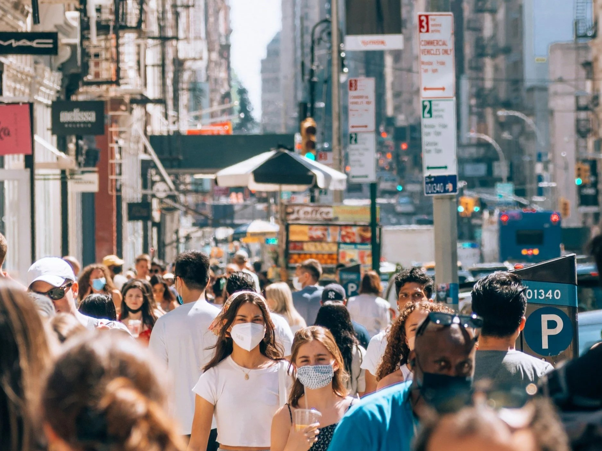

::: {.research-columns}

::: {.research-column}

## Social hierarchy in places, faces, and groups

{.research-banner}

Published Articles

::: {.pub-entry}
::: {.pub-citation}
Vossoughi, N., **Merrell, W.**, Kteily, N., Ho, A. (2026). The Role of Egalitarian Ideology in System-Challenging Collective Action among Members of Dominant and Marginalized Racial Groups. *Personality and Social Psychology Bulletin.* <https://doi.org/10.1177/01461672261427820>
:::

:::

::: {.pub-entry}
::: {.pub-citation}
**Merrell, W.**\*, Fan, L.\*, Sheehy-Skeffington, J., Thomsen, L. (2025). Resource possession in the mind's eye: Ideological convergence and divergence in the perceptions of poor people. *Personality and Social Psychology Bulletin.* <https://doi.org/10.1177/01461672251371787>
:::

:::

::: {.pub-entry}
::: {.pub-citation}
**Merrell, W.**, Ackerman, J. (2025). Flaunting Porsches or Paris? Comparing the social signaling value of experiential and material conspicuous consumption. *Personality and Social Psychology Bulletin.* <https://doi.org/10.1177/01461672251331658>
:::

:::

::: {.pub-entry}
::: {.pub-citation}
**Merrell, W.**, Vossoughi, N., Kteily, N., Ho, A. (2024). Looking White but feeling Asian: The role of perceived membership permeability and perceived discrimination in multiracial-monoracial alliances. *Personality and Social Psychology Bulletin.* <https://doi.org/10.1177/01461672241267332>
:::

:::

::: {.pub-entry}
::: {.pub-citation}
Fessler, D.\*, **Merrell, W.**\*, Holbrook, C., Ackerman, J. (2023). Beware the foe who feels no pain: Relationships between relative formidability and pain sensitivity in U.S. online samples. *Evolution and Human Behavior.* <https://doi.org/10.1016/j.evolhumbehav.2022.11.003>
:::

:::

Selected Work Under Review / In Preparation

**Merrell, W.**, Fan, L., Sheehy-Skeffington, J., Thomsen, L. (In principle acceptance). Height, hierarchy, and humanity: A registered replication and extension of Kunst et al. (2019). *Social Psychological & Personality Science.*

**Merrell, W.**, Fan, L., Sheehy-Skeffington, J., Thomsen, L. (Invited revise & resubmit). The folk psychology of spatial resource patchiness and social hierarchy. *Journal of Experimental Psychology: General.*

**Merrell, W.**, Fan, L., Gothreau, C., Laustsen, L. (Invited revise & resubmit). Democrats and Republicans hold similarly gendered mental images of ideal politicians. *Group Processes & Intergroup Relations.*

**Merrell, W.** (Invited revise & resubmit). Experiential vs. material conspicuous consumption signal distinct forms of status. *Journal of Consumer Psychology.*

**Merrell, W.**, Kruse, M., Laustsen, L. (In preparation). Thinking (fast and slow) in conjoint experiments: Disentangling automatic and deliberative religious biases.

**Merrell, W.**, Ho, A. (In preparation). How do racially minoritized perceivers categorize dual-minority multiracial people? The case of Kamala Harris.

**Merrell, W.**, Fan, L., Hjorth, F., Dinesen, P., Sønderskov, K. (In preparation). Bad is bigger than good: Threat and cognitive maps in a shared urban ecology.

Chaar, R.+, Pischel, K.+, Giritlioglu, A., **Merrell, W.**, Fessler, D. (In preparation). Ripped or racialized? Folk myths of muscularity in American Black men.

\* Represents equally shared first authorship

\+ Undergraduate student collaborator

:::

::: {.research-column}

## Psychology of infectious illness and sickness behavior

{.research-banner}

Published Articles

::: {.pub-entry}
::: {.pub-citation}
Ackerman, J., Samore, T., Fessler, D., Kupfer, T., Choi, S., **Merrell, W.**, et al. (2025). I see sick people: Beliefs about sensory detection of infectious disease are largely consistent across cultures. *Brain, Behavior and Immunity.* <https://doi.org/10.1016/j.bbi.2025.04.020>
:::

:::

::: {.pub-entry}
::: {.pub-citation}
**Merrell, W.**, Choi, S., Ackerman, J. (2024). When and why people conceal infectious disease. *Psychological Science.* <https://doi.org/10.1177/09567976231221990>
:::

:::

::: {.pub-entry}
::: {.pub-citation}
Choi, S., **Merrell, W.**, Ackerman, J. (2023). Safety first, but for whom? Shifts in risk perception for self and others following COVID-19 vaccination. *Social and Personality Psychological Compass.* <https://doi.org/10.1111/spc3.12757>
:::

:::

::: {.pub-entry}
::: {.pub-citation}
Choi, S., **Merrell, W.**, Ackerman, J. (2022). Keep your distance: Different roles for knowledge and affect in predicting social distancing behavior. *Journal of Health Psychology.* <https://doi.org/10.1177/13591053211067100>
:::

:::

::: {.pub-entry}
::: {.pub-citation}
Ackerman, J., **Merrell, W.**, Choi, S. (2020). What people believe about detecting infectious disease using the senses. *Current Research in Ecological and Social Psychology.* <https://doi.org/10.1016/j.cresp.2020.100002>
:::

:::

Selected Work Under Review / In Preparation

**Merrell, W.**, Meyer, M.^, Sabree, K.^, Gonzalez, R., Ackerman, J. (In preparation). Widespread disease concealment is linked to fears of social exclusion across societies.

**Merrell, W.**, Zubaly, B., Ackerman, J. (In preparation). Fear of exclusion and exploitation as motivational drivers of infectious disease concealment.

Fan, L.\*, **Merrell, W.**\*, Donner, M., Ackerman, J., Tybur, J. (In preparation). From whom do we hide our sickness? Interpersonal value and the selective concealment of infectious illness.

\* Represents equally shared first authorship

\^ Graduate student collaborator

:::

:::
